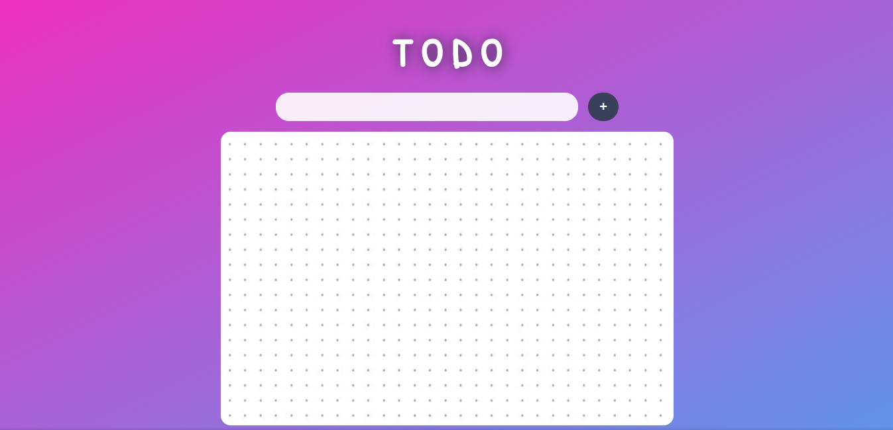
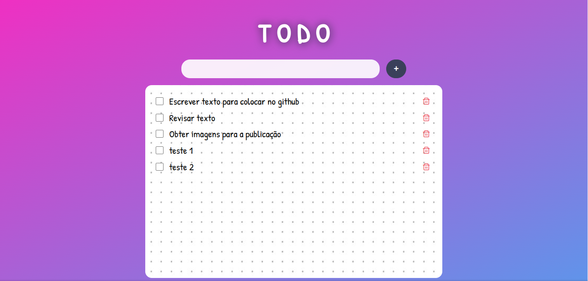
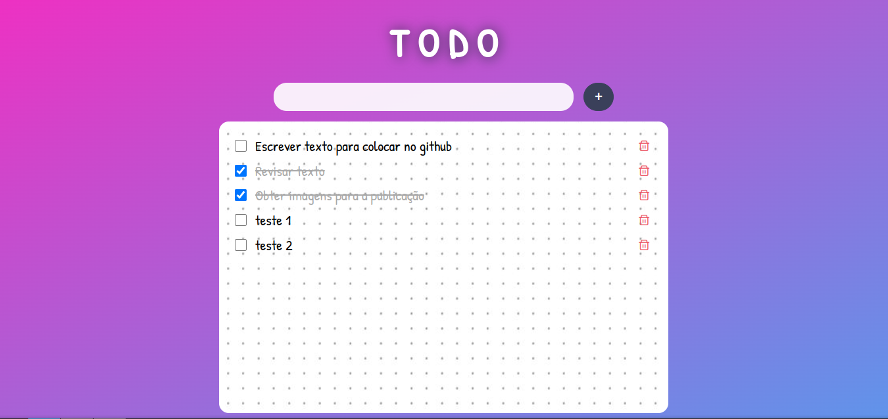
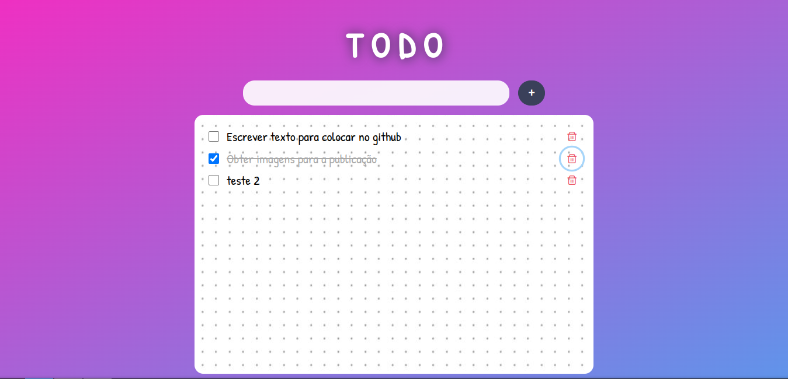

<h1 align="center">TO-DO APP</h1>
 
 

Ainda durante o Bootcamp Desenvolverdor(a) Front End, um dos Desafios Guiados do módulo de Vue.js, era desenvolver o projeto de To-Do list. 
Nesse projeto foi utilizado alguns componentes do Prime Vue, como o Button e Input Text.

O projeto era simples, pois o foco era aperfeiçoar a lógica e o uso do Vue.js, e então pensei em melhorar o visual do To-Do List, com uma estética que eu gostasse e que fizesse sentido com o projeto. Com isso, fui para o Pinterest e pesquisei inspírações de como eu gostaria que o meu To-Do list fosse, e a partir das referências fui estilizando o projeto conforme o que havia imaginado. E apesar da estilização tema do PrimeVue, fiz algumas alterações por cima dele.

 
<legend>Versão desktop - To-Do app </legend>

<legend>Versão desktop - To-Do app com tarefas inseridas </legend>

<legend>Versão desktop - To-Do app com tarefas completas  </legend>

<legend>Versão desktop - To-Do app com tarefas excluídas </legend>

 
